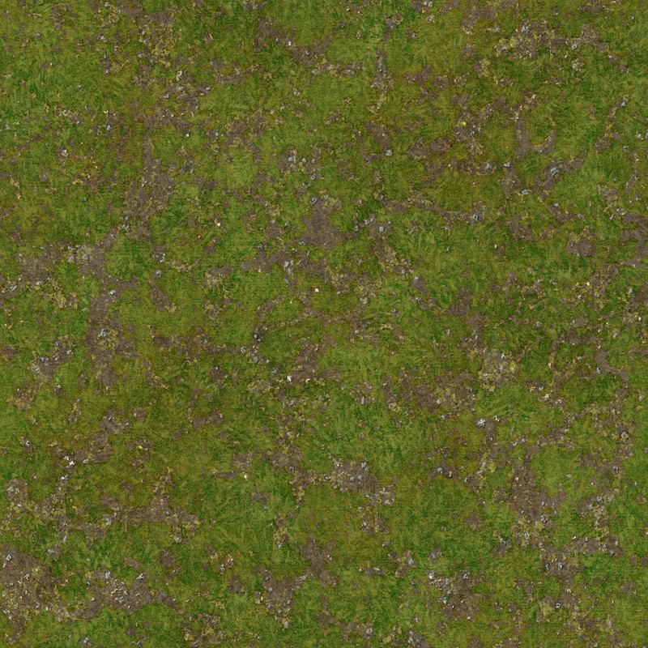
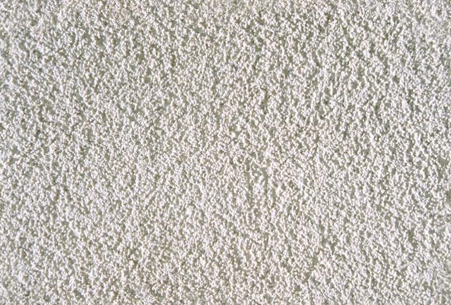
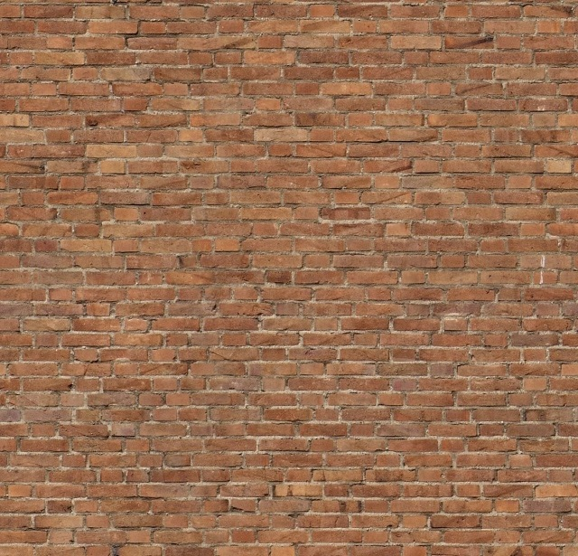
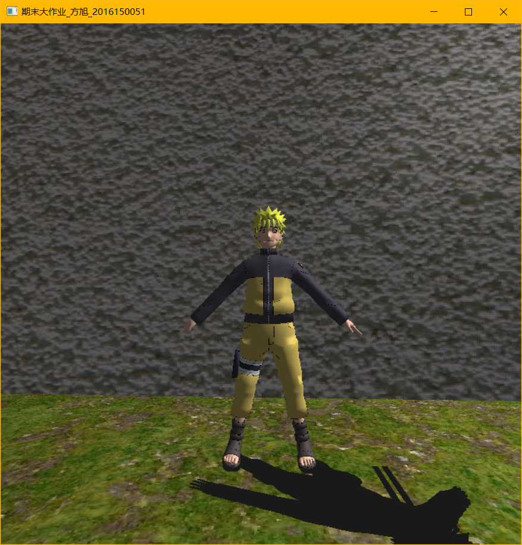
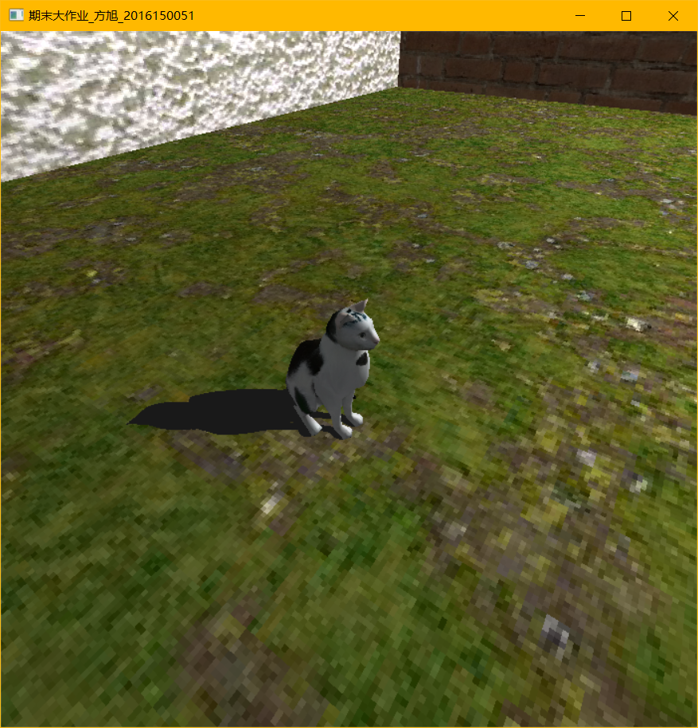
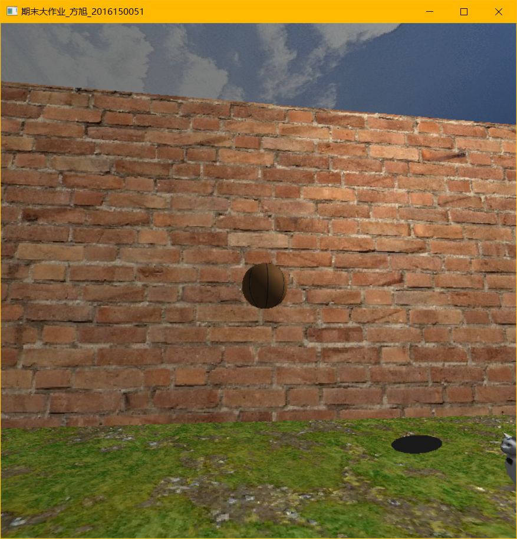
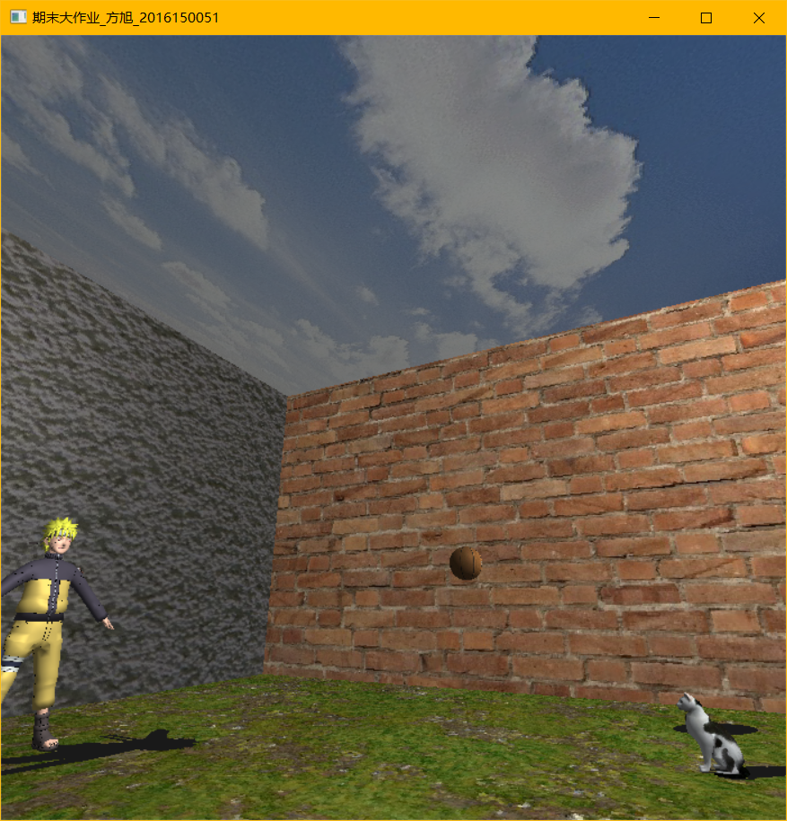
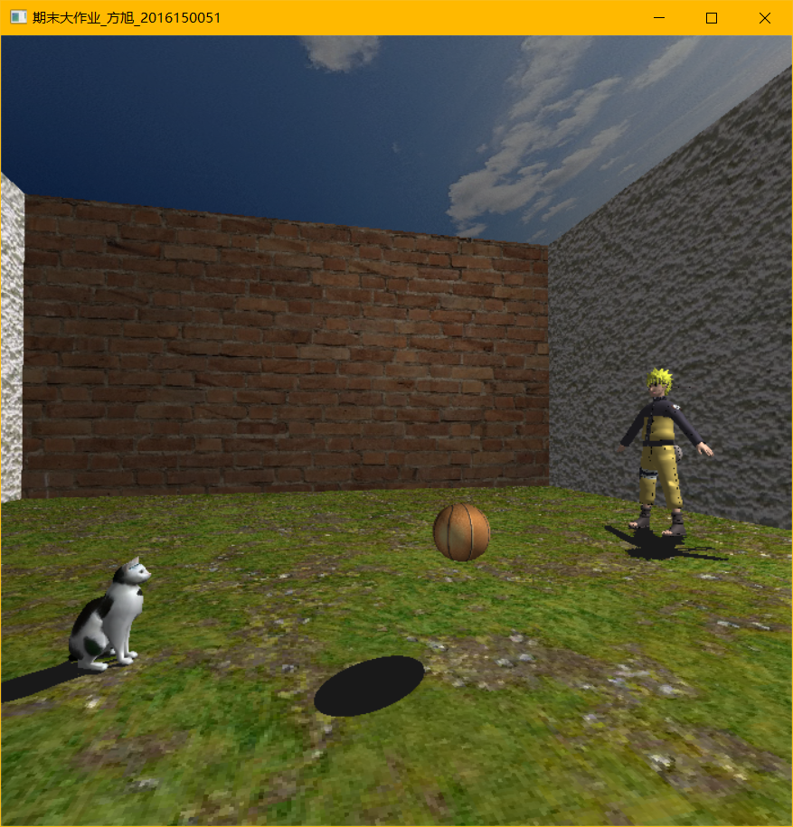

# simple_3d_scene-OpenGL
__`opengl`__

## Overview
&emsp;This simple 3d scene project is my final assignment of __Computer Graphics Class__. Because lacking of time, I have not yet understood how _Sky-Box_ works absolutely, so in the end I used six boards to sound a box instead of _Sky-Box_. I add lighting and shadow in the scene. There are three main models in it: Naruto, a cat and a basketball. Naruto and the cat can not move, but the basketball can bounce like real cases. I immitate the _camera_ from __FPS__ game. Based on it, you can move naturally and control the _camera_ with __'wsad'__ keys and _mouse_.

## Box
The box consists of following four textures:

 

 

I make the blank board by __3Ds Max__ for it can generate the board with coordinate. 

## Models
__There are three models:__

1. Naruto:

2. Cat:

3. Ball:

## Final scene
 

## How to operate
__w__: move forward

__s__: move back

__a__: move left

__d__: move right

__mouse__: shift orientation by all directions 

__p__: ball start bouncing

__o__: ball stop bouncing
